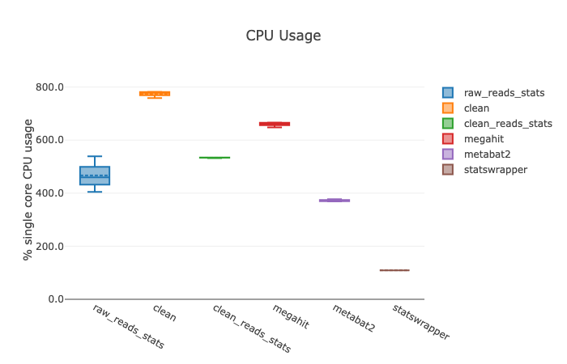
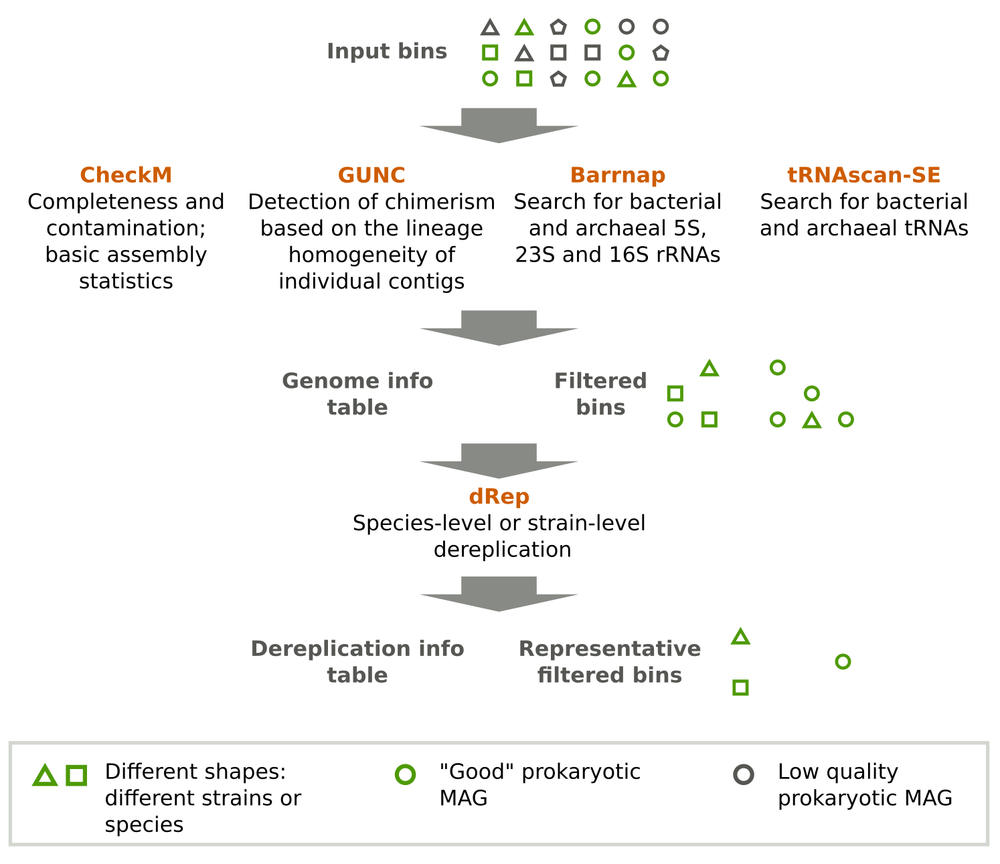
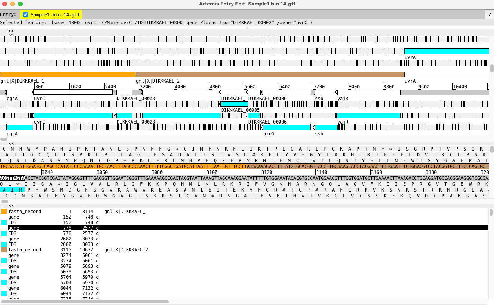

# Elixir Course, Bari, Italy, 2025
* [link arbitrario](https://github.com/metashot/mag-illumina)

# Hands-on n.1 - Taxonomic and functional profiling using shotgun data
## Preprocessing

#### Step n.0: download & install Anaconda **we did it already, don't do it** 
```
##wget https://repo.anaconda.com/archive/Anaconda3-2024.10-1-Linux-x86_64.sh
##bash Anaconda3-2024.10-1-Linux-x86_64.sh
```

#### Step n.1: get into the right place & check if your environment is present
```
cd /home/user<YOUR USER NAME>

path="/home/ubuntu/shotgun_course/anaconda3course/bin/"
source ${path}/activate

conda info --envs
```

#### Step n.2: raw data pre-processing on fastq example files "seq_1.fastq.gz" and "seq_2.fastq.gz" from https://github.com/biobakery/biobakery/wiki/kneaddata

```
## conda create -n <trimmomatic> -c bioconda trimmomatic ## DON'T DO IT. WE DID ALREADY
## conda create -n <bowtie2> -c bioconda bowtie2 ## DON'T DO IT. WE DID ALREADY
## conda create -n <samtools> -c bioconda samtools ## DON'T DO IT. WE DID ALREADY

mkdir 1_pre-processing
cd 1_pre-processing

wget https://github.com/biobakery/kneaddata/files/4703820/input.zip
unzip input.zip
cd input
```

#### Step n.3: Define variable "s" with the sampleID and run TRIMMOMATIC
```
s="seq"

source ${path}/activate trimmomatic

trimmomatic PE -threads 8 -phred33 -trimlog ${s}_trimmomatic.log ${s}1.fastq ${s}2.fastq \
${s}_filtered_1.fastq ${s}_unpaired_1.fastq ${s}_filtered_2.fastq ${s}_unpaired_2.fastq \
ILLUMINACLIP:${path}/../envs/trimmomatic/share/trimmomatic/adapters/TruSeq3-PE-2.fa:2:30:10 \
LEADING:20 TRAILING:20 SLIDINGWINDOW:4:15 MINLEN:75

for i in *.fastq; do echo -ne "${i}\t"; cat "$i" | wc -l; done
```

#### Step n. 4: Generate bowtie2 index of the human genome GCF_009914755.1_T2T-CHM13v2.0.fna (https://www.ncbi.nlm.nih.gov/datasets/genome/GCF_009914755.1/GCF_009914755.1_T2T-CHM13v2.0.fna)

Activate conda: Occhio che qui cambia tutto a seconda di dove salvi il T2T !
```
human_gen_path="/home/ubuntu/shotgun_course/human_genome/"
conda deactivate
source ${path}/activate bowtie2
```

Run bowtie alignment against the human genome:
```
##VERSION 4 HOURS LONG:
## mkdir -p ../human_genome/
## bowtie2-build ${human_gen_path}GCF_009914755.1_T2T-CHM13v2.0.fna ../human_genome/GCF_009914755.1_T2T-CHM13v2.0 ### DON'T RUN IT! IT TAKES A FEW HOURS TO BE EXECUTED

bowtie2 -x ${human_gen_path}GCF_009914755.1_T2T-CHM13v2.0 -1 ${s}_filtered_1.fastq -2 ${s}_filtered_2.fastq \
    -S ${s}.sam --very-sensitive-local -p 8

conda deactivate
source ${path}/activate samtools

samtools view -bS ${s}.sam > ${s}.bam
samtools view -b -f 12 -F 256 ${s}.bam > ${s}.bothunmapped.bam
samtools sort -n -m 5G -@ 2 ${s}.bothunmapped.bam -o ${s}.bothunmapped.sorted.bam
samtools fastq ${s}.bothunmapped.sorted.bam -1 >(gzip > ${s}_filtered.final_1.fastq.gz) -2 >(gzip > ${s}_filtered.final_2.fastq.gz) -0 /dev/null -s /dev/null -n
#rm ${s}.sam; rm ${s}.bam; rm ${s}.bothunmapped.bam; rm ${s}.bothunmapped.sorted.bam ### IF YOU WANT TO REMOVE THE INTERMEDIATE FILES

for i in *.fastq; do echo -ne "${i}\t"; cat "$i" | wc -l; done; echo; for i in *.gz; do echo -ne "${i}\t"; zcat "$i" | wc -l; done
```
Did the preprocessing produce the same exact number of reads in R1 and R2 ?


## MetaPhlAn 4: taxonomic profiling using marker genes
#### Step n.1: Setup correct variables, activate environment and navigate to the right folders

We create the conda environment **we did it already**
```
conda deactivate
source ${path}/activate

## conda create -n <mpa> -c conda-forge -c bioconda python=3.11 metaphlan=4.2.0
```

We move to use it
```
## cd /home/user<YOUR USER NAME>
cd ..

mkdir 2_metaphlan
cd 2_metaphlan

path="/home/ubuntu/shotgun_course/anaconda3course/bin/"

conda deactivate
source ${path}/activate
source ${path}/activate mpa

## metaphlan --install --db_dir metaphlan_databases
```

#### Step n.2: download metagenomic samples
```
mpa_db="/home/ubuntu/shotgun_course/metaphlan_databases/" !!! PATH DA MODIFICARE !!
## ESEMPIO SUL CM: /shares/CIBIO-Storage/CM/scratch/users/paolo.manghi/Elixir/2_metaphlan/metaphlan_databases/

db_version="mpa_vJan25_CHOCOPhlAnSGB_202503"

wget https://github.com/biobakery/MetaPhlAn/releases/download/4.0.2/SRS014476-Supragingival_plaque.fasta.gz
wget https://github.com/biobakery/MetaPhlAn/releases/download/4.0.2/SRS014494-Posterior_fornix.fasta.gz
wget https://github.com/biobakery/MetaPhlAn/releases/download/4.0.2/SRS014459-Stool.fasta.gz
wget https://github.com/biobakery/MetaPhlAn/releases/download/4.0.2/SRS014470-Tongue_dorsum.fasta.gz
wget https://github.com/biobakery/MetaPhlAn/releases/download/4.0.2/SRS014472-Buccal_mucosa.fasta.gz

s="SRS014476-Supragingival_plaque"
```

#### Step n.3: Run MetaPhlAn 4

Take look at the MetaPhlAn parameters
```
metaphlan -h
```

Then run it
```
metaphlan ${s}.fasta.gz --input_type fasta --mapout ${s}.bowtie2.bz2 --samout ${s}.sam.bz2 -o ${s}_profile.txt \
    --stat_q 0.1 --nproc 8 --db_dir ${mpa_db} --index ${db_version}

s="SRS014494-Posterior_fornix"; metaphlan ${s}.fasta.gz --input_type fasta --mapout ${s}.bowtie2.bz2 --samout ${s}.sam.bz2 -o ${s}_profile.txt \
    --stat_q 0.1 --nproc 8 --db_dir ${mpa_db} --index ${db_version}
s="SRS014459-Stool"; metaphlan ${s}.fasta.gz --input_type fasta --mapout ${s}.bowtie2.bz2 --samout ${s}.sam.bz2 -o ${s}_profile.txt \
    --stat_q 0.1 --nproc 8 --db_dir ${mpa_db} --index ${db_version}
s="SRS014470-Tongue_dorsum"; metaphlan ${s}.fasta.gz --input_type fasta --mapout ${s}.bowtie2.bz2 --samout ${s}.sam.bz2 -o ${s}_profile.txt \
    --stat_q 0.1 --nproc 8 --db_dir ${mpa_db} --index ${db_version}
s="SRS014472-Buccal_mucosa"; metaphlan ${s}.fasta.gz --input_type fasta --mapout ${s}.bowtie2.bz2 --samout ${s}.sam.bz2 -o ${s}_profile.txt \
    --stat_q 0.1 --nproc 8 --db_dir ${mpa_db} --index ${db_version}
s="SRS014494-Posterior_fornix"; metaphlan ${s}.fasta.gz --input_type fasta --mapout ${s}.bowtie2.bz2 --samout ${s}.sam.bz2 -o ${s}_profile.txt \
    --stat_q 0.1 --nproc 8 --db_dir ${mpa_db} --index ${db_version}

merge_metaphlan_tables.py *_profile.txt | grep -P "clade_name|UNCLASSIFIED|t__" > metaphlan_table.tsv
```

## Kraken + Bracken: taxonomic profiling using k-mers
#### Step n.1: Check everything is set up and create kraken + bracken DB

```
conda deactivate
## conda create -n <kraken_+_bracken> -c bioconda kraken2
source ${path}/activate kraken_+_bracken

cd ..
mkdir 3_kraken
cd 3_kraken

# wget https://genome-idx.s3.amazonaws.com/kraken/k2_standard_08gb_20250402.tar.gz
# mkdir -p kraken_DB && tar -xvzf k2_standard_08gb_20250402.tar.gz -C kraken_DB
# git clone https://github.com/jenniferlu717/KrakenTools.git
# chmod +x KrakenTools/*
```

#### Step n.3: Let's have a look at Kraken parameters
```
kraken -h
```

Run Kraken
```
for s in SRS014459-Stool.fasta.gz SRS014470-Tongue_dorsum.fasta.gz SRS014472-Buccal_mucosa.fasta.gz SRS014476-Supragingival_plaque.fasta.gz SRS014494-Posterior_fornix.fasta.gz;

do kraken2 --db kraken_DB/ --threads 8 --report `basename ${s%.fasta.gz}`.kraken2_report.txt --output `basename ${s%.fasta.gz}`.kraken2_output.txt ../2_metaphlan/${s}; done
```

Run Bracken
```
for s in SRS014459-Stool.fasta.gz SRS014470-Tongue_dorsum.fasta.gz SRS014472-Buccal_mucosa.fasta.gz SRS014476-Supragingival_plaque.fasta.gz SRS014494-Posterior_fornix.fasta.gz;

bracken -d kraken_DB/ -i `basename ${s%.fasta.gz}`.kraken2_report.txt \
  -o `basename ${s%.fasta.gz}`.bracken_abundance.txt \
  -w `basename ${s%.fasta.gz}`.bracken_report.txt -l S -t 150

done

for s in *.bracken_report.txt; do KrakenTools/kreport2mpa.py --display-header -r ${s} -o ${s%.txt}.mpa.tsv; done

KrakenTools/combine_mpa.py -i *.bracken_report.mpa.tsv -o merged_bracken_table.tsv

sed 's/.bracken_report.txt//g' merged_bracken_table.tsv | grep -P 'Classification|s__' | sed 's/Bacillati/Bacteria/g' | sed 's/Pseudomonadati/Bacteria/g' > bracken_table.tsv
```

## HUMAnN 4: functional profiling at the community level
#### Step n.1: Get into the right directory & install download the necessary files
```
conda deactivate
source ${path}/activate

## conda create -n <humann4> -c bioconda python=3.12 ## DON'T DO IT. WE DID ALREADY
conda activate humann
## conda config --add channels biobakery
## conda install humann=4.0 -c biobakery  ## DON'T DO IT. WE DID ALREADY

## conda install metaphlan=4.1 -c bioconda ## DON'T
## metaphlan --install --index mpa_vOct22_CHOCOPhlAnSGB_202403

mkdir -p 4_humann
cd 4_humann

## humann_databases --download chocophlan full humann_databases ## DON'T 
## humann_databases --download uniref uniref90_ec_filtered_diamond humann_databases ## DON'T
## humann_databases --download utility_mapping full humann_databases ## DON'T
```

#### Step n.2: test that HUMAnN runs properly and have a look at the HUMAnN parameters
```
humann_test
humann_config
humann -h
```

#### Step n.3: get a sample from EBI
```
wget ftp://ftp.sra.ebi.ac.uk/vol1/fastq/SRR154/096/SRR15408396/SRR15408396.fastq.gz
```

#### Step n.4: RUN humann
```
s="SRR15408396"

metaphlan_params="--index mpa_vOct22_CHOCOPhlAnSGB_202403 -t rel_ab_w_read_stats"

## NOW YOU CAN RUN:
## \humann --input ${s}.fastq.gz --output ${s} --threads 8 --nucleotide-database humann_databases/chocophlan/ --count-normalization RPKs --metaphlan-options "${metaphlan_params}"
## rm 4_humann/${s}/${s}_humann_temp/

## BUT IT TAKES THREE HOURS... OR YOU CAN RUN:
mkdir -p ${s}
```

Occhio che qui sistemare le cartelle !!!
```
cp /home/ubuntu/course_backup/course/4_humann/${s}/${s}_2_genefamilies.tsv ${s}/${s}_genefamilies.tsv
cp /home/ubuntu/course_backup/course/4_humann/${s}/${s}_3_reactions.tsv ${s}/${s}_reactions.tsv
cp /home/ubuntu/course_backup/course/4_humann/${s}/${s}_4_pathabundance.tsv ${s}/${s}_pathabundance.tsv
```

#### Step n.5: Regrouping genes to other functional categories
```
humann_regroup_table -i ${s}/${s}_genefamilies.tsv -o ${s}/${s}_pfam.tsv --groups uniref90_pfam
```

#### Step n.6: Run HUMAnN on a second sample
```
s="SRR15408398"

## SAME:
## wget ftp://ftp.sra.ebi.ac.uk/vol1/fastq/SRR154/098/SRR15408398/SRR15408398.fastq.gz

## \humann --input ${s}.fastq.gz --output ${s} --threads 8 --nucleotide-database humann_databases/chocophlan/ --count-normalization RPKs --metaphlan-options "${metaphlan_params}"
## rm 4_humann/${s}/${s}_humann_temp/

## FOR NOW, RUN:
mkdir ${s}
```

Occhio che qui sistemare le cartelle !!!
```
cp /home/ubuntu/course_backup/course/4_humann/${s}/${s}_4_pathabundance.tsv ${s}/${s}_pathabundance.tsv
```

#### Step n.7: Merge together community profiles under different ontologies
```
mkdir -p merged

cp SRR15408396/SRR15408396_pathabundance.tsv merged/
cp SRR15408398/SRR15408398_pathabundance.tsv merged/

humann_join_tables -i merged -o merged_pathabundance.tsv --file_name pathabundance
```

# Hands-on n.3 - Metagenome assembly and binning
## Approach n. 1: follow the protocol

#### Step n.1: check everything is set up, download a sample, and run Megahit
```
cd /home/user<YOUR USER NAME>
path="/home/ubuntu/shotgun_course/anaconda3course/bin/"

conda deactivate
source ${path}/activate

## conda create -n <megahit> -c bioconda megahit ## DON'T DO IT. WE DID ALREADY
source ${path}/activate megahit

mkdir 5_assembly
cd 5_assembly

wget ftp://ftp.sra.ebi.ac.uk/vol1/fastq/SRR341/SRR341725/SRR341725_[12].fastq.gz

megahit -h

s="SRR341725"
## MEGAHIT WILL TAKE A FEW HOURS:
## megahit -1 ${s}_1.fastq.gz -2 ${s}_2.fastq.gz -o ${s}.megahit_asm -t 8

## FOR NOW WE CAN COPY THE RESULTS FROM MEGAHIT
mkdir -p ${s}.megahit_asm/

cp /home/ubuntu/course_backup/course/7_assembly/${s}.megahit_asm/final.contigs.fa  ${s}.megahit_asm/
cp /home/ubuntu/course_backup/course/7_assembly/${s}.megahit_asm/contigs.fasta  ${s}.megahit_asm/

## WE ALSO NEED TWO CUSTOM SCRIPT:
cp /home/ubuntu/course_backup/course/7_assembly/filter_contigs.py .
cp /home/ubuntu/course_backup/course/7_assembly/megahit2spades.py .
```

#### Step n.2: Binning, i.e. grouping assemblies into genomes using MetaBat2
```
source ${path}/activate
 
## conda create -n <metabat2> -c bioconda metabat2 ## DON'T DO IT. WE DID ALREADY
source ${path}/activate metabat2

## conda install -c bioconda <bowtie2> ## DON'T DO IT. WE DID ALREADY
## conda install -c bioconda <samtools> ## DON'T DO IT. WE DID ALREADY

mkdir 6_MAG-reconstruction
cd 6_MAG-reconstruction

s="SRR341725"

cp ../5_assembly/SRR341725.megahit_asm/contigs_filtered.fasta ./
cp ../5_assembly/SRR341725_1.fastq.gz ./
cp ../5_assembly/SRR341725_2.fastq.gz ./

bowtie2-build contigs_filtered.fasta contigs_filtered
bowtie2 -x contigs_filtered -1 ${s}_1.fastq.gz -2 ${s}_2.fastq.gz -S ${s}.sam -p 8 2> ${s}.bowtie2.log

### THE FOLLOWING MIGHT RAISE DISK ISSUE:
## samtools view -bS ${s}.sam > ${s}.bam
## samtools sort ${s}.bam -o sorted_${s}.bam

## COPY THE RESULT FOR NOW:
cp /home/ubuntu/course_backup/course/8_MAG-reconstruction/sorted_SRR341725.bam .

jgi_summarize_bam_contig_depths --outputDepth ${s}_depth.txt sorted_${s}.bam 2> ${s}_depth.log
```

#### Step n.3: Run MetaBat 2 for binning
```
metabat2 -i contigs_filtered.fasta -a ${s}_depth.txt -o ${s}_bins/bin -m 1500 --unbinned -t 8 > ${s}_metabat2.log
```

#### Step n.4: Estimate MAG quality using checkM2
```
conda deactivate

## conda create -n <checkm2> -c bioconda checkm2 ## DON'T DO IT. WE DID ALREADY

source ${path}/activate checkm2
## pip install absl-py==1.1.0 ## DON'T DO IT. WE DID ALREADY

## LET'S NOT DOWNLOAD THE DATABASE
## checkm2 database --download --path ./

## WE CAN USE A COPY
checkm2_db="/home/ubuntu/course_backup/course/8_MAG-reconstruction/CheckM2_database/uniref100.KO.1.dmnd"
checkm2 testrun --database_path ${checkm2_db} --threads 8

checkm2 predict -i SRR341725_bins -o SRR341725_checkm2 -x .fa --database_path ${checkm2_db} --threads 8

awk -F'\t' '$2 > 50 && $3 < 5' SRR341725_checkm2/quality_report.tsv > SRR341725_checkm2/quality_report_filtered.tsv

mkdir -p ${s}_bins_filtered
cut -f1 SRR341725_checkm2/quality_report_filtered.tsv | while read -r value; do cp ${s}_bins/${value}.fa ${s}_bins_filtered/; done
```

## Approach n. 2: run the nextflow workflow

Warning: the nextflow commands are here for explanatory purposes only: each of them will require from hours to days to run and considerable computational resouces. The results have been pre-computed and are already present on your workspace.

Make sure that you have nextflow and singularity installed

https://www.nextflow.io/

https://docs.sylabs.io/guides/latest/user-guide/

#### Step 1: Assembly and binning

```
Basic command: 

cd mag
 nextflow run metashot/mag-illumina \
   --assembler "megahit" \
   --reads '../fastq/*_R{1,2}.fastq.gz' \
   --outdir results \ 
   -with-report report.html
```
This commamnd runs the assembly (using megahit) and binning workflow using paired-ends read files in the ../fastq/ directory. 
With this syntax, each "\*_R1.fastq.gz" file will be matched with the corresponding "\*_R2.fastq.gz" file.
The workflow will produce two folders and one report file: 
* the report.html file contains a report of the tasks run by the workflow with details on the resources used and outcome
* the "work" directory contains intermediate files. These files allow the workflow manager to reuse already performed steps if something goes wrong or you want to change something (option "-resume"). **WARNING:** the "work" directory can become quite big and take a lot of disk space. Keep it **ONLY** until you think you need to rerun the workflow adding new data or using different parameters. The either delete it directly or use the command "nextflow clean" to get rid of the intermediate files.
* the "results" folder contains results files. The results directory contains:
    * scaffolds: scaffolds for each input sample;
    * bins: genome bins produced by Metabat2;
    * unbinned: unbinned contigs;
    * stats_scaffolds.tsv: scaffold statistics;

See https://github.com/metashot/mag-illumina for complete documentation

The actual command run to produce the output can be found in the file "mag.sh". The commando contains the option "-c" that is used to specify a site specific configuration file

The file "nf-machina-low.conf" is an example of a site specific configuration file that we used on the HPC cluster of S. Michele

The "nf-machina-low.conf"  contains the lines

```
docker.enabled = false
singularity.enabled = true
```
that instruct the workflow manager to use singularity containers instead of docker. The lines:

```
process.executor = 'sge'
process.penv = 'smp'
```

 are cluster specific options that instruct nextflow to use Sun Grid Engine (sge) as executor with multi-thread environment (smp). This configuration file needs to be changed depending on the environment where you run your job. See the nextflow documentation for details on how to do that https://www.nextflow.io/docs/latest/config.html 


Let's explore the output:

Click on the "report.html" file. you will find a set of reports on the job that was run, including resources used (memory, time, etc.) by each process




The assembled scaffold are in the "results/scaffolds" directory
```
(base) -bash-4.2$ cd results/scaffolds/
(base) -bash-4.2$ ls
Sample1.fa  Sample2.fa  Sample3.fa
(base) -bash-4.2$ head Sample1.fa
>k141_0 flag=1 multi=1.0000 len=358
AGTATTAATCCGTCTAGCTCTAGATTTGCCAAACCAAAACGGGCTTCATCACGAGTCATCCCACCTGGTGGTCATGCGTCAGTGATTTGGATGGGGTGGGAGGGAGTGTGTGGGTTAGGTGGATGTTTGTTTGGTGGTGGGGGGGGGGTGTTATAAAAAAAAAAAAAAAAAAAAAAAAAAAAAAAAAAACCACGCGAAAAATAAAAATAAAAAAAAAAAAAAAAAAAAAAATAAAAAAACAAAAAAAAAAAAAAAAAAAAAAAAAAAAAAAAAAAAAAAAAAAAAAAAAAAAAAAAAAAAAAAAAAAAAAAAAAAAAAAAAAAAAAAAAAAAAAAAAAAAAAAAAAAAAAAAAAAAAA
>k141_659211 flag=1 multi=2.0000 len=305
AGGCAGCACTTACAGGCAATGCGGCCACGATAGCGGACGCCGAGGCCTTCCGCTACAAGGGTCAC
```

The table "stats_scaffolds.tsv"

contains basic assembly statistics

```
base) -bash-4.2$ more results/stats_scaffolds.tsv 
n_scaffolds	n_contigs	scaf_bp	contig_bp	gap_pct	scaf_N50	scaf_L50	ctg_N50	ctg_L50	scaf_N90	scaf_L90	
ctg_N90	ctg_L90	scaf_max	ctg_max	scaf_n_gt50K	scaf_pct_gt50K	gc_avg	gc_std	filename
723443	723443	583269202	583269202	0.000	99194	960	99194	960	538340	353	538340	353	1283613	1283613	313	
6.349	0.54500	0.11001	/nfs2/donatic/projects/Scuola_Bari/mag/work/17/b05c9d5e911502be97ed6e220a5971/Sample1.fa
```

The folder "bins" contains individual bins (candidate genomes) binned by Metabat2

```
(base) -bash-4.2$ ls results/bins/ | head
Sample1.bin.1.fa
Sample1.bin.10.fa
Sample1.bin.11.fa
Sample1.bin.12.fa
```


#### Step 2: Bin quality

The next step is to filter bins according to their "quality". Quality is assessed using three basic criteria, namely: 
* completeness, i.e. the estimated fraction of the genome that is actually in the bin;
* contamination, i.e. the fraction of the bin that comes from a different species 
* strain heterogeneity, i.e. the fraction of teh genome that comes from a closely related species, possibly the same. 

```
cd quality

nextflow run metashot/prok-quality \
  --genomes '../mag/results/bins/*.fa' \
  --outdir results \
    -with-report report.html
```
This command uses the bin fasta files from the previous step as input, and produces a report on their completeness and contamination. The workflow integrates several tools that look at different aspects of genome quality. This a schema of the workflow





Again, the worflow will produce a "work" directory and a "results" directory
Main output can be found in the "results" directory:

* genome_info.tsv: summary table of genomes quality collecting the results of the different tools. Columns are: 
    * Genome: the genome filename
    * Completeness, Contamination, Strain heterogeneity: CheckM estimates
    * GUNC pass: if a genome doesn't pass GUNC analysis it means it is likely to be chimeric
    * Genome size (bp), ... 
    * \# predicted genes: basic genome statistics 
    * 5S rRNA, 23S rRNA, 16S rRNA \# tRNA, # tRNA types: the number and types of rRNA and tRNA genes  respecively

```
(base) -bash-4.2$ head results/genome_info.tsv 
Genome	Completeness	Contamination	Strain heterogeneity	GUNC pass	Genome size (bp)	# ambiguous bases	# scaffolds	# contigs	N50 (scaffolds)	N50 (contigs)	Mean scaffold length (bp)	Mean contig length (bp)	Longest scaffold (bp)	Longest contig (bp)	GC	GC std (scaffolds > 1kbp)	Coding density	# predicted genes	5S rRNA	23S rRNA	16S rRNA	# tRNA	# tRNA types
Sample1.bin.1	0.0	0.0	0.0	True	202153	0	1	1	202153	202153	202153	202153	202153	202153	45.2	0.0	91.78	314	No	No	No	37	20
Sample1.bin.10	84.95	16.77	6.17	True	4611297	0	659	659	8642	8642	6997	6997	59844	59844	65.5	2.45	91.63	4970	No	No	No	41	17
```

* filtered genomes: a folder containg the genomes passing the qulity filter

```
(base) -bash-4.2$ ls results/filtered | head
Sample1.bin.14.fa
Sample1.bin.15.fa
Sample1.bin.21.fa
```
* genome_info_filtered.tsv: same as genome_info.tsv, only for genomes passing the quality filter.
* derep_info.tsv: table containg the dereplication summary. Columns are: 
    * Genome: genome filename
    * Cluster: the cluster ID (from 0 to N-1)
    * Representative: is this genome the cluster representative?
```
(base) -bash-4.2$ head results/derep_info.tsv 
Genome	Cluster	Representative
Sample1.bin.34	10	True
Sample1.bin.67	21	True
Sample1.bin.3	32	True
```
* filtered_repr: folder containing the filered and representative genomes

A note on dereplication: many of the assembled genomes in the different samples might just be different representatives of the same species. So, how would you avoid inflating the estimated diversity of the environment you are studying? One solution is to "cluster" MAGs into species level bins according to some pre-defined distance treshold, and select the most complete MAG as representative. DREP does exactly that. The assumption is that MAGs above 95% ANIbelong to the same species. As for any assumption, this is questionable.

See https://github.com/metashot/prok-quality for complete documentation

Limitations: this (and the following) step of the pileline makes strong assumtions on the nature of the data. For instance, here we assume that all assembled genomes are either bacteria or archaea. If you have eukaryotes (fungi, for istance) in your sample, they will be discarded at this stage. For a possible Eukaryotic pipeline see https://github.com/metashot/awemags


#### Step 3: Taxonomic classification of bins

This step classifies the genomes passing the qulity filter of the previous step according to the GTDB (https://gtdb.ecogenomic.org/) schema and the GTDB-Tk tookit (https://github.com/Ecogenomics/GTDBTk). In this example we assume that you have downloaded the reference GTDB database in the folder "./release220". See the file "classify.sh" for the actual command run to produce the output

```
cd classify 
nextflow run compmetagen/prok-classify \
  --genomes "../quality/*.fa" \
  --gtdbtk_db ./release220 \
  --outdir results
    -with-report report.html
```

Output:

* bacteria_taxonomy.tsv: the GTDB-Tk summary for bacterial genomes;

```
(base) -bash-4.2$ head results/bacteria_taxonomy.tsv 
user_genome	classification	closest_genome_reference	closest_genome_reference_radius	closest_genome_taxonomy	closest_genome_ani	closest_genome_af	closest_placement_reference	closest_placement_radius	closest_placement_taxonomy	closest_placement_ani	closest_placement_af	pplacer_taxonomy	classification_method	note	other_related_references(genome_id,species_name,radius,ANI,AF)	msa_percent	translation_table	red_value	warnings
Sample1.bin.14.fa	d__Bacteria;p__Pseudomonadota;c__Gammaproteobacteria;o__Burkholderiales;f__Methylophilaceae;g__Methylotenera;s__	N/A	N/A	N/A	N/A	N/A	N/A	N/A	N/A	N/A	N/A	d__Bacteria;p__Pseudomonadota;c__Gammaproteobacteria;o__Burkholderiales;f__Methylophilaceae;g__Methylotenera;s__	taxonomic classification fully defined by topology	classification based on placement in class-level tree	N/A	72.65	11	0.9721	N/A
```

* archaea_taxonomy.tsv: the GTDB-Tk summary for archaeal genomes;
* bacteria_genomes: folder containing the genomes classified as bacteria by GTDB-Tk;
* archaea_genomes: folder containing the genomes classified as archaea by GTDB-Tk.

Complete documentation in https://github.com/metashot/prok-classify

#### Step 4: Functional annotation of genomes

This workflow perform gene prediction and functional annotation of prokaryotic genomes. Necessary databases are downloaded automatically

```
cd annotate
nextflow run metashot/prok-annotate \
  --genomes "../quality/results/*.fa" \
  --outdir results
```

Input: prokaryotic contig/genomes in FASTA format;
* Functional annotation using Prokka;
* Functional annotation through orthology assignment by eggNOG-mapper v2 and the eggNOG v5.0 database (optional);
* KEGG ortholog assignment by KofamScan and the KOfam database (https://www.genome.jp/tools/kofamkoala/) (optional);
* Estimates KEGG pathway completeness using Anvi'o (https://merenlab.org/software/anvio/) (optional);

The workflows takes individual MAGs in fasta format, predicts genes using Prodigal, annotates the genomes usig Prokka, and performs a functional annotation of the predicted proteins using several tools and database. The workflow is not specific to MAGs: it can be used on any bacterial genome.
The workflow produces several folders and summary tables:

* tool-specific folders: anvio, eggnog, kofamscan, prodigal, prokka. These folders contain the results of each tool run on each individual genome.

```
(base) -bash-4.2$ ls results/eggnog/* | more
results/eggnog/Sample1.bin.14:
Sample1.bin.14.emapper.annotations
Sample1.bin.14.emapper.hits
Sample1.bin.14.emapper.seed_orthologs

results/eggnog/Sample1.bin.15:
Sample1.bin.15.emapper.annotations
Sample1.bin.15.emapper.hits
Sample1.bin.15.emapper.seed_orthologs
```
Summary tables contain information from each of the individual tool. For instance, the table eggnog_KEGG_Pathway.tsv contains, for each MAG, the count of proteins in each metabolic pathway defined by the Kegg database.

```
base) -bash-4.2$ more results/eggnog_KEGG_Pathway.tsv 
	Sample1.bin.31	Sample1.bin.14	Sample1.bin.30	Sample1.bin.21	Sample1.bin.32	Sample1.bin.15	Sample1.bin.25	Sample1.bin.29	Sampl
e1.bin.3	Sample1.bin.34	Sample1.bin.23	Sample1.bin.36	Sample1.bin.42	Sample1.bin.49	Sample1.bin.41	Sample1.bin.67	Sample1.bin.6
1	Sample1.bin.9	Sample1.bin.53	Sample1.bin.6	Sample1.bin.62	Sample1.bin.7	Sample2.bin.18	Sample2.bin.19	Sample2.bin.13	Sampl
e1.bin.76	Sample1.bin.65	Sample2.bin.10	Sample2.bin.25	Sample2.bin.12	Sample2.bin.16	Sample2.bin.3	Sample2.bin.28	Sample2.bin.4
2	Sample2.bin.22	Sample2.bin.23	Sample2.bin.21	Sample2.bin.31	Sample2.bin.26	Sample2.bin.27	Sample2.bin.41	Sample2.bin.36	Sampl
e2.bin.50	Sample2.bin.53	Sample2.bin.35	Sample2.bin.49	Sample3.bin.31	Sample2.bin.44	Sample2.bin.62	Sample2.bin.56	Sample2.bin.4
8	Sample3.bin.30	Sample3.bin.1	Sample3.bin.29	Sample2.bin.51	Sample2.bin.60	Sample2.bin.57	Sample2.bin.9	Sample2.bin.63	Sampl
e3.bin.100	Sample2.bin.46	Sample3.bin.11	Sample3.bin.119	Sample3.bin.109	Sample3.bin.118	Sample3.bin.17	Sample3.bin.20	Sample3.bin.1
16	Sample3.bin.22	Sample3.bin.13	Sample3.bin.16	Sample3.bin.25	Sample3.bin.95	Sample3.bin.32	Sample3.bin.70	Sample3.bin.69	Sampl
e3.bin.99	Sample3.bin.46	Sample3.bin.58	Sample3.bin.39	Sample3.bin.33	Sample3.bin.44	Sample3.bin.38	Sample3.bin.52	Sample3.bin.6
5	Sample3.bin.63	Sample3.bin.53	Sample3.bin.61	Sample3.bin.8	Sample3.bin.51	Sample3.bin.64	Sample3.bin.71	Sample3.bin.79	Sampl
e3.bin.91	Sample3.bin.77	Sample3.bin.93	Sample3.bin.81	Sample3.bin.83
-	274	1244	950	988	610	1569	1155	513	1354	1211	2381	1109	1386	1677	638	1428	765	2679	1283	608	1072	1797	1468	1926	1914	1642	1584	1895	1856	2355	3883	1598	1292	1977	27531230	3275	1735	2684	2102	1837	967	2741	993	1155	343	611	1823	2242	1405	3095	1217	11891817	366	2253	4123	325	1397	737	1801	885	1229	568	912	506	889	1302	1651	827	716	2561	1049	1981	538	626	755	1418	606	177	1841	1136	472	1202	1347	652	645	709	12261836	739	766	854	426	587	1265	1009	1932
ko00010	6	16	21	16	31	20	26	24	25	23	33	15	25	28	25	24	28	28	20	23	16	35	30	31	29	22	26	27	27	34	36	17	22	30	25	34	33	25	33	25	23	14	25	24	31	10	28	25	21	38	34	22	19	26	15	29	40	4	21	13	35	20	21	15	21	23	18	24	21	17	27	27	31	37	18	19	25	25	20	11	24	27	22	29	22	20	21	27	18	29	14	17	16	18	23	32	17	26
ko00030	7	16	17	14	17	13	13	14	12	14	20	11	16	25	16	9	16	20	17	16	15	21	16	20	25	13	24	18	17	17	35	8	12	25	20	21	28	16	25	13	14	9	27	17	19	6	13	18	26	20	28	17	13	18	9	23	46	1	21	9	30	15	11	6	18	14	12	15	19	9	24	18	17	22	11	9	11	14	12	3	16	15	13	23	14	13	14	14	11	20	9	12	11	9	12	15	16	20
```
**Caveat** Since each protein can appear in more than one pathway, sometimes number do not add up so easily. Make sure you know what you are doing when you draw conclusions from these numbers. Please refer to the documentation of each individual annotation tool.

The folder results/prokka contains annotated MAGs in several formats. You can look at the gff files using a genome browser such as Artemis (https://sanger-pathogens.github.io/Artemis/Artemis/). Pay attention to a few things:

* Contigs are **NOT** ordered. Genes on the same contig that are close in the browser, are close in real world. You have no info concerning the mutal positions of genes in different contigs. To reorder the contigs you will need a reference genome.
* The annotation provided by Prokka is a basic annotation. Other tools (eggnog, kofamscan, etc) will provide more complete info.



# Hands-on n.3 (BONUS) - Taxonomic profiling beyond the level of species
#### Step n.1: get into the right place

```
cd /home/user<YOUR USER NAME>
path="/home/ubuntu/shotgun_course/anaconda3course/bin/"

conda deactivate
source ${path}/activate
source ${path}/activate mpa
```

#### Step n.2: Getting example files (6 fastq files) from https://github.com/biobakery/MetaPhlAn/wiki/StrainPhlAn-4.1
```
wget http://cmprod1.cibio.unitn.it/biobakery4/github_strainphlan4/fastq/SRS013951.fastq.bz2
wget http://cmprod1.cibio.unitn.it/biobakery4/github_strainphlan4/fastq/SRS014613.fastq.bz2
wget http://cmprod1.cibio.unitn.it/biobakery4/github_strainphlan4/fastq/SRS019161.fastq.bz2
wget http://cmprod1.cibio.unitn.it/biobakery4/github_strainphlan4/fastq/SRS022137.fastq.bz2
wget http://cmprod1.cibio.unitn.it/biobakery4/github_strainphlan4/fastq/SRS055982.fastq.bz2
wget http://cmprod1.cibio.unitn.it/biobakery4/github_strainphlan4/fastq/SRS064276.fastq.bz2
```

#### Step n.3: Running MetaPhlAn 4

* Approach n. 1 ==> Running MetaPhlAn 4 to obtain the .sam files of the marker genes' alignments
```
## mpa_db="/home/ubuntu/shotgun_course/metaphlan_databases/"
## db_version="mpa_vJun23_CHOCOPhlAnSGB_202403"

## s="SRS013951"; metaphlan ${s}.fastq.bz2 --input_type fastq --mapout ${s}.bowtie2.bz2 --samout ${s}.sam.bz2 -o ${s}_profile.txt --nproc 8 \
##     --bowtie2db ${mpa_db} --index ${db_version}
## s="SRS014613"; metaphlan ${s}.fastq.bz2 --input_type fastq --mapout ${s}.bowtie2.bz2 --samout ${s}.sam.bz2 -o ${s}_profile.txt --nproc 8 \
##     --bowtie2db ${mpa_db} --index ${db_version}
## s="SRS019161"; metaphlan ${s}.fastq.bz2 --input_type fastq --mapout ${s}.bowtie2.bz2 --samout ${s}.sam.bz2 -o ${s}_profile.txt --nproc 8 \
##     --bowtie2db ${mpa_db} --index ${db_version}
## s="SRS022137"; metaphlan ${s}.fastq.bz2 --input_type fastq --mapout ${s}.bowtie2.bz2 --samout ${s}.sam.bz2 -o ${s}_profile.txt --nproc 8 \
##     --bowtie2db ${mpa_db} --index ${db_version}
## s="SRS055982"; metaphlan ${s}.fastq.bz2 --input_type fastq --mapout ${s}.bowtie2.bz2 --samout ${s}.sam.bz2 -o ${s}_profile.txt --nproc 8 \
##     --bowtie2db ${mpa_db} --index ${db_version}
## s="SRS064276"; metaphlan ${s}.fastq.bz2 --input_type fastq --mapout ${s}.bowtie2.bz2 --samout ${s}.sam.bz2 -o ${s}_profile.txt --nproc 8 \
##     --bowtie2db ${mpa_db} --index ${db_version}
```

Approach n. 2 ==> Copy the .sam alignments from a pre-existing repository
OCCHIO AI PATH
```
cp /home/ubuntu/course_backup/course/4_strainphlan/SRS013951.sam.bz2 .
cp /home/ubuntu/course_backup/course/4_strainphlan/SRS014613.sam.bz2 .
cp /home/ubuntu/course_backup/course/4_strainphlan/SRS019161.sam.bz2 .
cp /home/ubuntu/course_backup/course/4_strainphlan/SRS022137.sam.bz2 .
cp /home/ubuntu/course_backup/course/4_strainphlan/SRS055982.sam.bz2 .
cp /home/ubuntu/course_backup/course/4_strainphlan/SRS064276.sam.bz2 .
```

#### Step n.4: Extract for each sample the alignments over its markers
```
mpa_database="/home/ubuntu/shotgun_course/metaphlan_databases/mpa_vJun23_CHOCOPhlAnSGB_202403.pkl"
sample2markers.py -i *.sam.bz2 -o ./ -n 8 -d ${mpa_database}
```

#### Step n.5: Extract marker genes for a species of interest
```
mkdir -p db_markers
```

* Approach n. 1 ==> run the dedicate command
```
extract_markers.py -c t__SGB1877 -o db_markers/ -d ${mpa_database} ## TOO LONG,
```
* Approach n. 2 ==> Copy the pre-built marker files
```
cp /home/ubuntu/course_backup/course/4_strainphlan/db_markers/t__SGB1877.fna db_markers/
```

#### Step n.6: Also include a reference genome ("GCF000273725")
```
mkdir -p reference_genomes
wget -P reference_genomes/ http://cmprod1.cibio.unitn.it/biobakery4/github_strainphlan4/reference_genomes/G000273725.fna.bz2
```

#### Step n.7: Let's look the StrainPhlAn params
```
strainphlan -h
```

#### Step n.8: Run StrainPhlAn 4
```
mkdir -p strainphlan_output
strainphlan -s *.json.bz2 -m db_markers/t__SGB1877.fna -r reference_genomes/G000273725.fna.bz2 -o strainphlan_output -c t__SGB1877 -n 8 -d ${mpa_database}
```

#### Step n.9: Let's visualize it ! 
```
wget http://cmprod1.cibio.unitn.it/biobakery4/github_strainphlan4/fastq/metadata.txt
add_metadata_tree.py -t output/RAxML_bestTree.t__SGB1877.StrainPhlAn4.tre -f metadata.txt -m subjectID --string_to_remove .fastq.bz2

conda deactivate
source ${path}/activate graphlan
${path}/../envs/mpa/bin/plot_tree_graphlan.py -t output/RAxML_bestTree.t__SGB1877.StrainPhlAn4.tre.metadata -m subjectID
```
